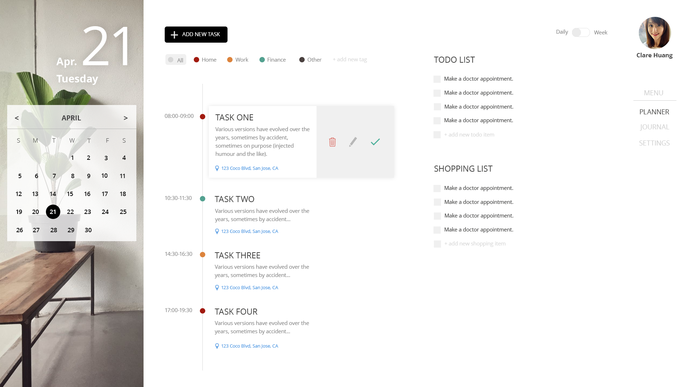
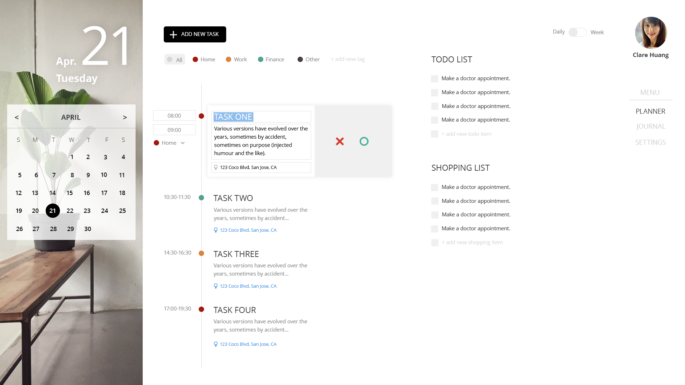
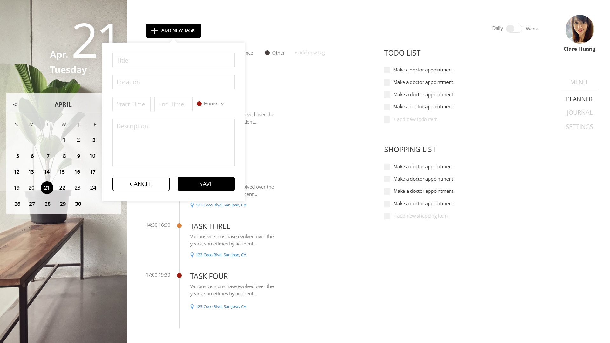
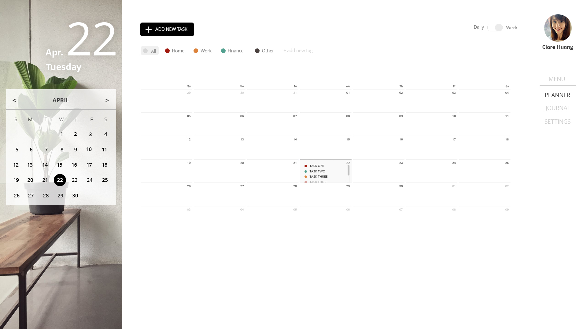
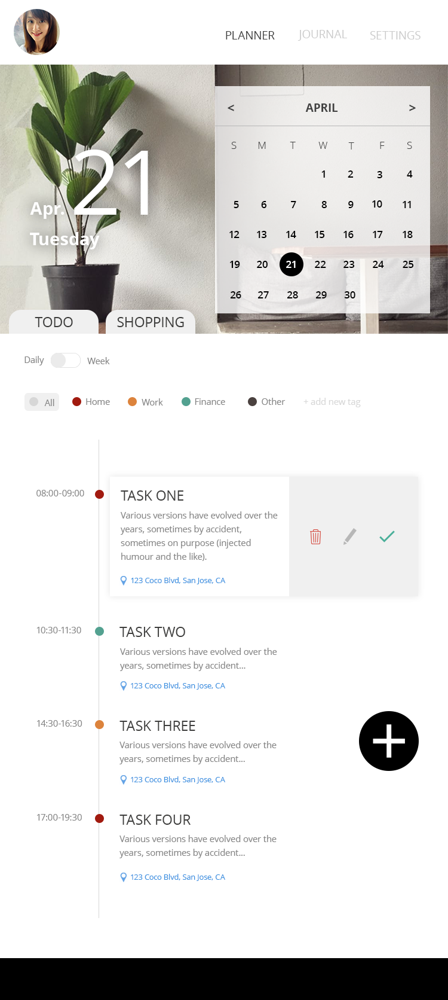

# rhea

## Usage

```bash
$ npm i
$ npm start
```


## UI Design
#### Planner - check tasks


#### Planner - edit tasks


#### Planner - add tasks


#### Planner - monthly calendar


#### Planner - mobile

